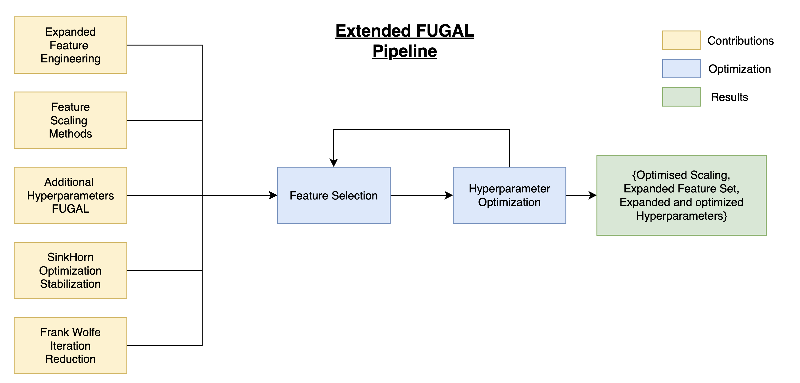
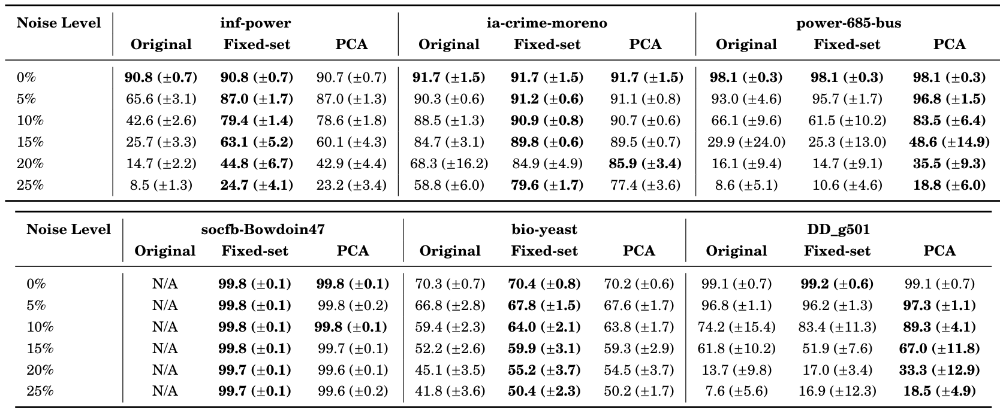
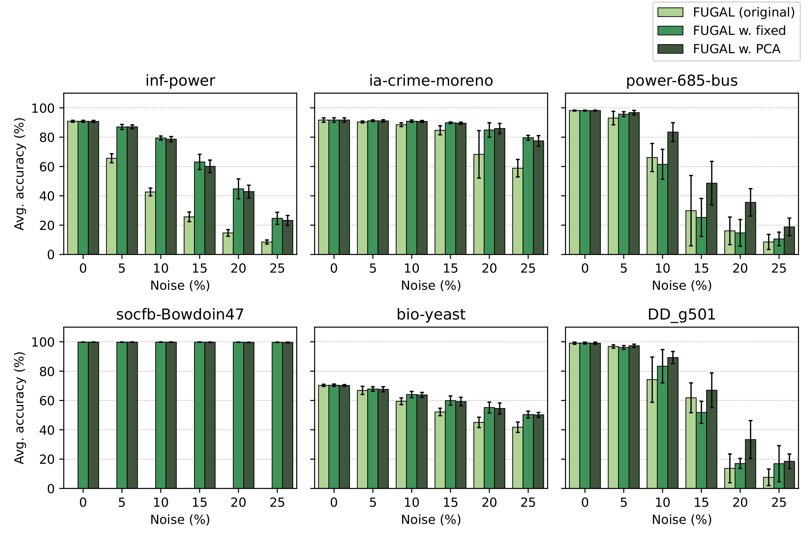
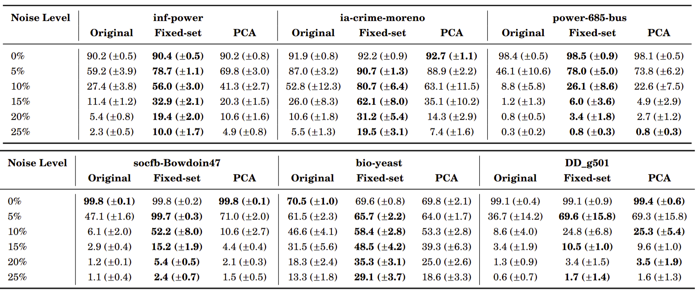
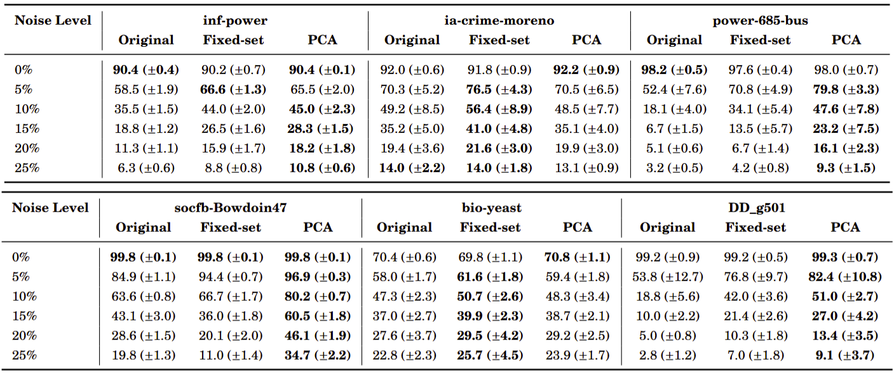
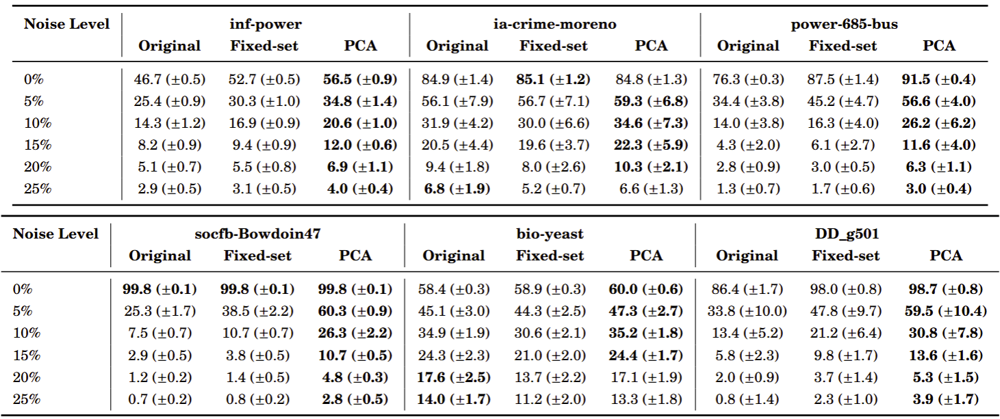

# Extending FUGAL and Other Graph Alignment Algorithms

**Master's Thesis — Aarhus University, Department of Computer Science**  
**Authors:** Nina Gad Lauridsen (202005129), Pi Bohlbro (202004918)  
**Supervisor:** Davide Mottin  
**Co-Supervisors:** Konstantinos Skitsas, Panagiotis Karras  
**Date:** June 2025  

## Abstract

This work extends the FUGAL algorithm for graph alignment, enhancing its accuracy and robustness across varied domains. We introduce an extensive feature study, multiple algorithmic refinements, and comprehensive hyperparameter tuning. Our contributions improve performance not only for FUGAL but also benefit algorithms like GRAMPA, IsoRank, and REGAL through generalized feature engineering insights.


## Algorithms 
The algorithms included in this thesis are listed below

|   Algorithm   |                               Paper                               |                  Original Code                  |
|:--------:|:-----------------------------------------------------------------:|:-----------------------------------------------:|
| Fugal        |                         [NeurIPS '2024](https://proceedings.neurips.cc/paper_files/paper/2024/file/22b111819c74453837899689166c4cf9-Paper-Conference.pdf)                         |                   [Python](https://github.com/idea-iitd/Fugal)                   |
|  Regal     |   [CIKM '2018](https://dl.acm.org/doi/10.1145/3269206.3271788)    |   [Python](https://github.com/GemsLab/REGAL)    |
|  Isorank     |      [PNAS'2008](https://www.pnas.org/content/105/35/12763)       |      [-](http://cb.csail.mit.edu/cb/mna/)       |
| Grampa        |  [ICML'2020](https://dl.acm.org/doi/abs/10.5555/3524938.3525218)  |                     [-](-)                      |
|  CΟΝΕ-ALign   |    [CIKM '20](https://dl.acm.org/doi/10.1145/3340531.3412136)     | [Python](https://github.com/GemsLab/CONE-Align) |


## Main Contributions

The following contributions were made to extend and improve FUGAL:

- **Expanded Feature Engineering**: Integration of extensive structural and global features including novel egonet descriptors.
- **Feature Scaling**: Empirical evaluation of six scaling strategies; identified collective robust normalization as the most stable and generalizable.
- **Additional Hyperparameters**: Tuned and extended FUGAL’s optimization settings using Bayesian optimization.
- **Sinkhorn Optimization Stabilization**: Scaled cost matrices to prevent overflow and maintain numerical stability.
- **Frank-Wolfe Iteration Reduction**: Experimentally determined optimal number of iterations, while improving efficiency.

## Extended FUGAL Pipeline



- **Yellow**: Novel contributions to FUGAL.
- **Blue**: Optimization phases including feature selection and tuning.
- **Green**: Final output: The refined algorithm and parameter settings.

## Evaluation Summary

Experiments were run on real-world datasets with increasing synthetic noise (0–25%). The final feature-augmented FUGAL achieved consistently higher alignment accuracy, with improvements generalized to GRAMPA, IsoRank, and REGAL.

### Evaluation datasets

The primary evaluation are based on the six graphs

|   Dataset   |     Type     |
|:--------:|:------------:|
|  inf-power       |         [Infrastructure ](https://networkrepository.com/inf-power.php) |
| ia-crime-moreno | [Interaction](https://networkrepository.com/ia-crime-moreno.php) |
| power-685-bus | [Power](https://networkrepository.com/power-685-bus.php) |
| socfb-Bowdoin47        |             [Communication](https://networkrepository.com/socfb-Bowdoin47.php)      |
| bio-yeast | [Biological](https://networkrepository.com/bio-yeast.php) |
| DD\_g501 | [Protein](https://networkrepository.com/DD-g501.php) |

### Main Evaluation Results
The following Figure and Table benchmarks our contributions against the original FUGAL algorithm. The values in parentheses and the errorbars represent the 95% confidence interval. The bold values are the best results per graph and noise level.





____
#### GRAMPA


#### IsoRank


#### REGAL



## Repository Structure

```
.
├── algorithms/CONE/conealign.py    # CONE implementation
├── algorithms/FUGAL/fugal.py       # FUGAL implementation
├── algorithms/isorank/isorank2.py  # IsoRank implementation
├── algorithms/GrampaS/GrampaS.py   # GRAMPA implementation
├── algorithms/REGAL/regal.py       # REGAL implementation
├── data/                           # Graph data files
├── data_analysis/                  # Data processing scripts
├── data_analysis/hyperparam_tuning.py   # Hyperparameter tuning 
├── requirements.txt                # Python dependencies
├── plots/                          # Visual assets and result plots
└── workexp.py                      # Main launching script
```

## Installation

To install the necessary dependencies:

```bash
pip install -r requirements.txt
```

## Usage

Run a named configuration experiment with:

```bash
python workexp.py with tuning
```

Named configurations are defined in [`experiment/experiments.py`](experiment/experiments.py).

To launch hyperparameter tuning:

```bash
python -m data_analysis.hyparam_tuning --tune <tuning-option>
```

For full feature selection, scaling tests, and reproducibility, see the [`notebooks/`](notebooks/) directory.


You can access our project dashboard and model tracking via:
- [GitHub Repository](https://github.com/ninagad/Framework_GraphAlignment-FUGAL-feature-testing)
- [W&B Dashboard](https://wandb.ai/ninagad-aarhus-university/projects)

## Citation

To cite this work:

> Nina Gad Lauridsen, Pi Bohlbro. _Improving Graph Alignment Algorithms_. Master’s Thesis, Aarhus University, 2025.

BibTeX:
```bibtex
@mastersthesis{bohlbrolauridsen2025fugal,
  title={Improving Graph Alignment Algorithms},
  author={Lauridsen, Nina Gad and Bohlbro, Pi},
  school={Aarhus University},
  year={2025}
}
```

## Contact

For questions, suggestions, or collaborations:
- Nina Gad Lauridsen — 202005129@post.au.dk
- Pi Bohlbro — 202004918@post.au.dk


## Acknowledgements
This repository is based on [this repository](https://github.com/constantinosskitsas/Framework_GraphAlignment) and extends it. 

We want to thank our advisor Davide Mottin, and co-advisors Konstantinos Skitsas and Panagiotis Karras. We thank you for your guidance and valuable insights throughout this work.
